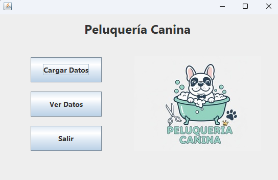
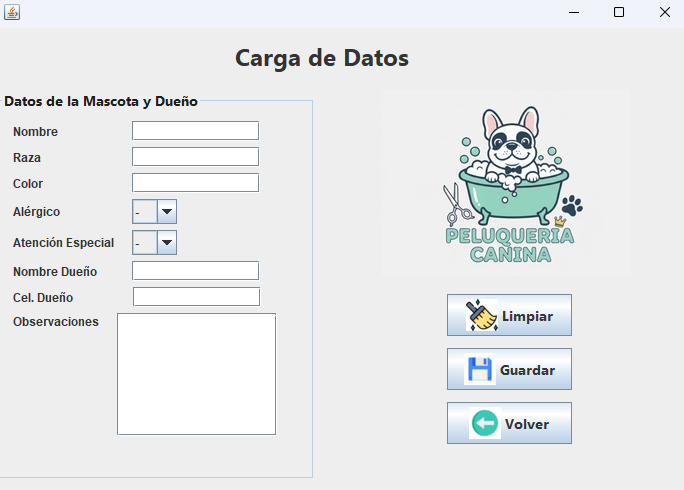

# 🐾 Peluquería Canina - Java Desktop App

Este es un sistema de gestión integral para una peluquería canina, desarrollado como proyecto final de tesis para demostrar habilidades en programación orientada a objetos y persistencia de datos.

---

## 🚀 Funcionalidades / Features
* **CRUD Completo**: Gestión total de registros de mascotas y dueños (Crear, Leer, Actualizar y Eliminar).
* **Persistencia**: Uso de JPA para una comunicación fluida con la base de datos.
* **Interfaz Profesional**: Diseño con Java Swing incluyendo iconos personalizados y ventanas de confirmación para seguridad del usuario.

## 📸 Capturas de Pantalla / Screenshots
> *Aquí puedes ver el sistema en funcionamiento:*

## 🛠️ Stack Tecnológico / Tech Stack
* **Language**: Java 17+
* **Persistence**: JPA / EclipseLink
* **Database**: MySQL (XAMPP)
* **Version Control**: Git & GitHub

## 📦 Instalación y Uso / Installation
1. **Clona el repositorio**: `git clone https://github.com/YeissonG/PeluquericaCanina.git`
2. **Base de Datos**: Importa el archivo `.sql` incluido en tu servidor MySQL (XAMPP).
3. **IDE**: Abre el proyecto en **NetBeans**.
4. **Librerías**: Configura las librerías ubicadas en la carpeta `/lib`.
5. **Ejecución**: Ejecuta la clase principal y ¡listo!

---
*I am currently a student at A2 English level, and I am passionate about developing software solutions with Java.*
